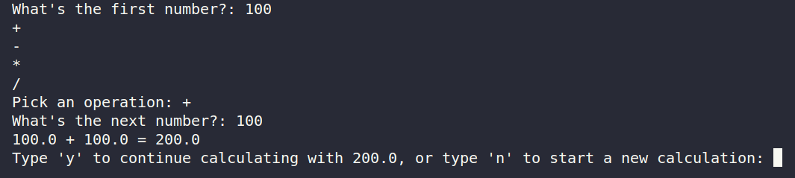

# Calculator

## 🛠 Description
A calculator using for basic math equation, built by using python.

## ⚙️ Languages or Frameworks Used

You only need Python to run this script. You can visit [here](https://www.python.org/downloads/) to download Python.

## 🌟 How to run
`python calculator.py`

## 📺 Demo
