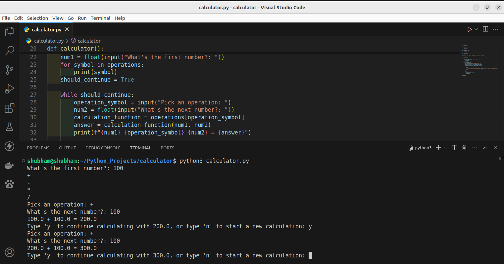

# Simple Calculator

## Screenshot

## 🛠 Description

This project is a basic calculator built with [Python 3](https://www.python.org/downloads/) that performs standard arithmetic operations such as addition, subtraction, multiplication, and division. The program takes user input to select an operation and enter numbers, then outputs the result. Designed to be user-friendly, it’s an excellent project for practicing Python fundamentals, including functions, conditionals, and loops. This calculator can be extended with additional operations or error-handling features for a more robust experience.

## ⚙️ Languages or Frameworks Used

You only need Python to run this script. You can visit [here](https://www.python.org/downloads/) to download Python.

## 🌟 How to run

+ `python3 calculator.py`
