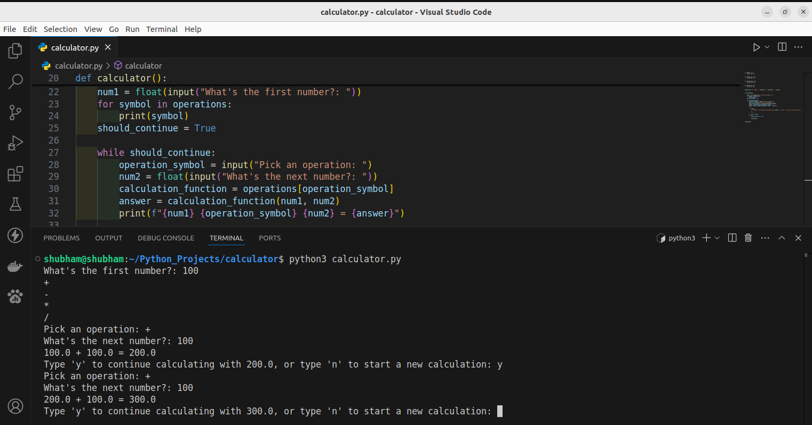

# Simple Calculator

A basic calculator built with Python — performs standard arithmetic operations right from your terminal.

---

## Table of Contents

- [About the Project](#about-the-project)
- [Features](#features)
- [Requirements](#requirements)
- [How to Run](#how-to-run)
- [How to Use](#how-to-use)
- [Future Improvements](#future-improvements)
- [Contributing](#contributing)
- [License](#license)

---

## About the Project

This project is a basic calculator built with [Python 3](https://www.python.org/downloads/) that performs standard arithmetic operations such as addition, subtraction, multiplication, and division. The program takes user input to select an operation and enter numbers, then outputs the result.
Designed to be user-friendly, it's an excellent project for practicing Python fundamentals, including functions, conditionals, and loops. This calculator can be extended with additional operations or error-handling features for a more robust experience.

## Features

- Performs addition, subtraction, multiplication, and division
- Simple, user-friendly input prompts
- Lightweight, text-based interface with no extra dependencies
- Easy-to-read code, great for beginners learning Python

## Requirements

You only need Python 3 to run this script.

- [Download Python](https://www.python.org/downloads/)

## How to Run

Running the script is really simple! Just open a terminal in the folder where your script is located and run:
    python3 calculator.py

## How to Use

1. Launch the script using the command above.
2. Select the operation you want to perform (addition, subtraction, multiplication, or division).
3. Enter the numbers you want to calculate.
4. The result is displayed in the terminal.

## Future Improvements

- Add support for more operations (exponents, square roots, modulus)
- Add error handling for invalid input and division by zero
- Build a graphical interface using Tkinter
- Add a calculation history feature

## Contributing

Contributions, issues, and feature requests are welcome.
Feel free to check the [issues page](../../issues) if you want to contribute.

## License

This project is licensed under the MIT License — feel free to use, modify, and distribute it.
